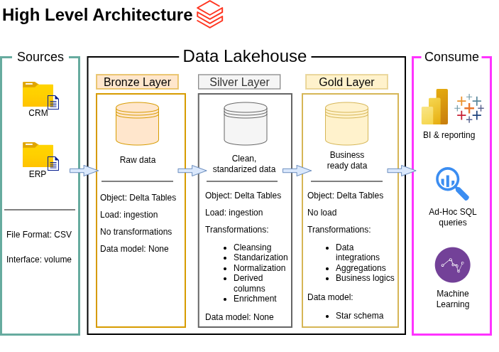

# Data Lakehouse Project

Welcome to my **Data Lakehouse** repository! 
This project demonstrates a data lakehousing solution in Databricks, from buiding a data lakehouse to generating actionable insights. It is designed as a portfolio project to showcase my Databricks and PySpark skills, as well as to highlight industry best practices in data engineering. 
The data sources, architecture, and models are the same as in my [Data Warehouse prokect](https://github.com/AstroTati/DataWarehouse-SQL.git). If you have been there, the following is going to look very familiar.

---

## 🏗️ Data Architecture

The data architecture for this project follows Medallion Architecture **Bronze**, **Silver**, and **Gold** layers:\
\


1. **Bronze Layer**: Raw data ingestion, schema inference and Delta tables storage.
2. **Silver Layer**: Data cleansing, standarization, and normalization. Type casting and validation.
3. **Gold Layer**: Business-ready data modeled into a star schema required for reporting and analytics.

---

## 📖 Project Overview

This project involves:

1. **Data Architecture**: Designing a Modern Data Warehouse Using Medallion Architecture **Bronze**, **Silver**, and **Gold** layers.
2. **ETL Pipelines**: Extracting, transforming, and loading data from source systems into the lakehouse.
3. **Data Modeling**: Developing fact and dimension tables optimized for analytical queries.

🎯 This repository showcases expertise in:
- PySpark and SQL Development
- Data Architecture
- Data Engineering  
- ETL Pipeline Developer  
- Data Modeling  

---

## 🛠️ Links & Tools:

- **[Databricks Learn](link):** Free tool hosting the data lakehouse and database.
- **[Datasets](datasets/):** Access to the project dataset (csv files).
- **[DrawIO](https://www.drawio.com/):** Design data architecture, models, flows, and diagrams.
- **[GitHub](www.github.com):** Version control.

---

## 🚀 Project

### Building the Data Lakehouse

#### Objective
Develop a modern data lakehouse using Databricks to consolidate sales data, enabling analytical reporting and informed decision-making.

#### Specifications
- **Data Sources**: Import data from two source systems (ERP and CRM) provided as CSV files.
- **Data Quality**: Cleanse and resolve data quality issues prior to analysis.
- **Integration**: Combine both sources into a single, user-friendly data model designed for analytical queries.
- **Scope**: Focus on the latest dataset only; historization of data is not required.
- **Documentation**: Provide clear documentation of the data model to support both business stakeholders and analytics teams.


## 📂 Repository Structure
```
data-warehouse-project/
│
├── datasets/                           # Raw datasets used for the project (ERP and CRM data)
│
├── docs/                               # Project documentation and architecture details
│   ├── high_level_architecture.png     # Image file shows the project's architecture
│   ├── data_catalog.md                 # Catalog of datasets, including field descriptions and metadata
│   ├── data_model.png                  # Image file for data model (star schema)
│   ├── naming_conventions.md           # Consistent naming guidelines for tables, columns, and files
│
├── scripts/                            # SQL scripts for ETL and transformations
│   ├── bronze/                         # Scripts for extracting and loading raw data
│   ├── silver/                         # Scripts for cleaning and transforming data
│   ├── gold/                           # Scripts for creating analytical models
│
├── README.md                           # Project overview and instructions
├── LICENSE                             # License information for the repository
├── .gitignore                          # Files and directories to be ignored by Git
```
---

## 🛡️ License

This project is licensed under the [MIT License](LICENSE). You are free to use, modify, and share this project with proper attribution.

## 🌟 About Me

I'm **Tatiana M. Rodriguez**, a data professional with a Ph.D. in Physics and a knack for bringing order to chaos. I'm transitioning from academia into data engineering, where I can apply the same analytical rigor to problems that drive real business decisions. 

Let's stay in touch! Feel free to connect with me on the following platforms:

[](https://linkedin.com/in/tmrodriguez-work)
[](www.tmrodriguez.com) 
[](mailto:tatianamrodriguez.contact@gmail.com)
